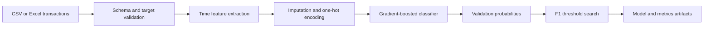

<div align="center">

# Retail Transaction Fraud Classifier

**Leakage-aware fraud detection with threshold tuning for imbalanced decisions**

[](https://github.com/Mahdi-Jadidi/retail-fraud-classifier/actions/workflows/ci.yml)


</div>

## Overview

This project predicts whether a retail transaction is fraudulent from transaction amount, customer activity, payment method, device, merchant, location, behavioral flags, and time information. The design treats fraud detection as an imbalanced decision problem: ranking quality matters, but the final probability threshold must also balance missed fraud against review volume.

## Historical benchmark

| Model | Test F1 | ROC-AUC | PR-AUC |
|---|---:|---:|---:|
| LightGBM | 0.8116 | 0.9148 | 0.9132 |
| XGBoost | 0.8112 | 0.9144 | 0.9124 |
| Random Forest | 0.8110 | 0.9150 | 0.9130 |
| CatBoost | 0.7910 | 0.9023 | 0.8994 |
| Weighted ensemble | **0.8168** | **0.9151** | **0.9135** |

These values are retained as the original research benchmark. The current package writes fresh metrics for every run and does not hard-code benchmark claims into inference.

## Current pipeline



## Evaluation

The run reports precision, recall, F1, PR-AUC, and ROC-AUC when both classes are present. Threshold search is isolated to the validation split so test labels do not influence the operating point.

## Quick start

```bash
git clone https://github.com/Mahdi-Jadidi/retail-fraud-classifier.git
cd retail-fraud-classifier
pip install -e ".[dev]"
retail-fraud train --train-path train.xlsx --target fraud_flag --output-dir artifacts
```

CSV and Excel inputs are supported. When `--target` is omitted, common fraud-label column names are detected automatically.

## Repository layout

```text
src/retail_fraud/
├── data.py       # file loading and target validation
├── features.py   # temporal and mixed-type preprocessing
├── metrics.py    # threshold search and evaluation
├── pipeline.py   # training and persistence
└── cli.py
```

## Artifacts

- `model.joblib`: complete preprocessing and classifier pipeline.
- `metrics.json`: validation metrics and selected threshold.

## Limitations

Fraud prevalence and attacker behavior drift over time. A deployed system would need chronological backtesting, calibration monitoring, cost-sensitive threshold selection, and periodic retraining rather than relying on one static hold-out score.
